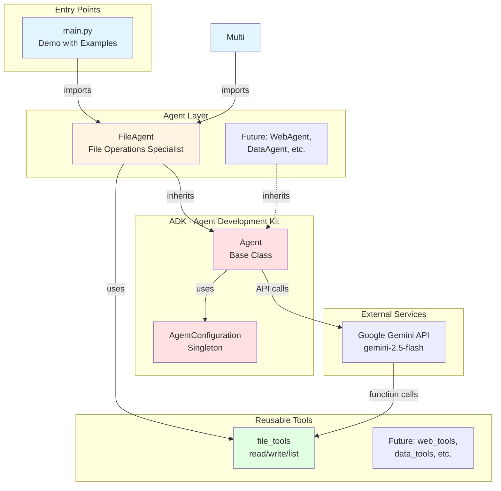
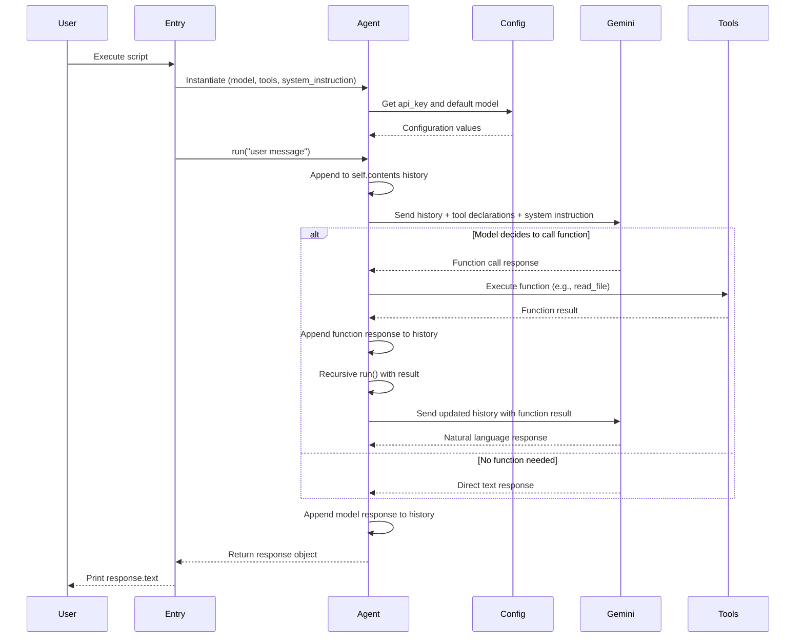
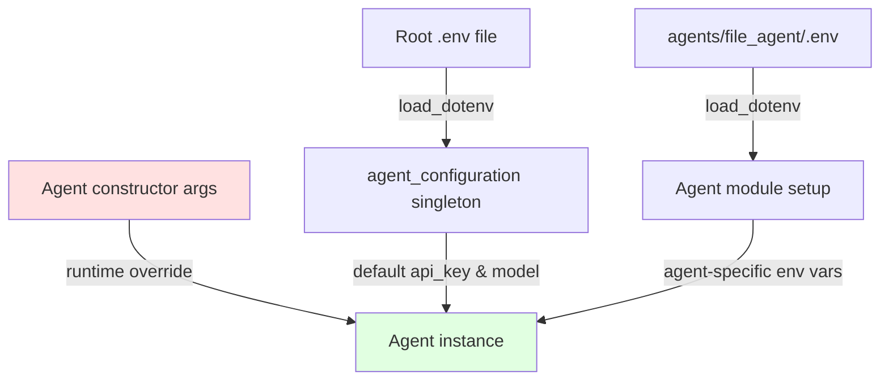

# Codebase Map

> Auto-generated by Cartographer. Last mapped: January 15, 2026

## System Overview

A three-tier Python framework for building AI agents with Google's Gemini API. The architecture separates reusable infrastructure (ADK), domain-agnostic tools, and specialized agent implementations, demonstrating modular design for conversational AI with function calling capabilities.



## Directory Structure

```
hello-genai/
├── adk/                          # Agent Development Kit (Core Framework)
│   ├── __init__.py              # Exports Agent, AgentConfiguration
│   ├── agent.py                 # Base Agent class with conversation management
│   ├── agent_configuration.py   # Configuration singleton with env loading
│   └── README.md                # ADK documentation
│
├── utils/                        # Utility Functions
│   ├── __init__.py              # Exports log_function_call
│   └── decorators.py            # Function decorators (logging, etc.)
│
├── agents/                       # Specialized Agent Implementations
│   ├── __init__.py              # Exports FileAgent
│   └── file_agent/              # File system specialist agent
│       ├── __init__.py          # Exports FileAgent class
│       ├── file_agent.py        # FileAgent implementation
│       └── .env.example         # Agent-specific config template
│
├── tools/                        # Reusable Tool Functions
│   ├── __init__.py              # Exports file_tools and individual functions
│   └── file_tools.py            # File operations: read/write/list
│
├── tests/                        # Test Suite
│   ├── __init__.py              # Test package initialization
│   ├── test_file_tools.py       # Tests for file tools
│   └── test_decorators.py       # Tests for decorators
│
├── main.py                       # Main demo with FileAgent examples
├── README.md                     # Quick start guide
├── AGENTS.md                     # AI agent guidance document
├── pyproject.toml                # uv package configuration
├── .python-version               # Python 3.14 requirement
└── .gitignore                    # Git exclusions
```

## Module Guide

### ADK (Agent Development Kit)

The core framework providing infrastructure for building AI agents.

#### adk/agent.py (922 tokens)

**Purpose**: Base Agent class implementing conversational AI with function calling

**Exports**:
- `Agent` - Main agent class with conversation history and tool execution

**Key Methods**:
- `Agent.__init__(model, tools, system_instruction)` - Initialize with optional model override, tools list, and system prompt
- `Agent.run(contents)` - Execute conversation turn (supports string or list of parts for function responses)

**Dependencies**:
- `google.genai` - Google's GenAI SDK for Gemini API
- `google.genai.types` - Type definitions for API configuration
- `.agent_configuration` - Configuration singleton

**Patterns**:
- **Stateful Conversation**: Maintains history in `self.contents` list (alternating user/model messages)
- **Recursive Function Calling**: When model requests function calls, executes them and recursively calls `run()` with results
- **Dependency Injection**: Tools passed as list of Python functions
- **Configuration Defaulting**: Uses `agent_configuration` singleton for model and API key if not provided

**Gotchas**:
- Conversation history persists across `run()` calls on same instance (not thread-safe)
- Function calling is implicit - model autonomously decides when to use tools
- No explicit error handling for failed API calls or function executions
- Response structure depends on GenAI API format (accesses `response.candidates[0].content`)

---

#### adk/agent_configuration.py (332 tokens)

**Purpose**: Configuration management with environment variable loading

**Exports**:
- `AgentConfiguration` - Configuration class
- `agent_configuration` - Singleton instance (instantiated at module load)

**Key Attributes**:
- `api_key` - Gemini API key (required, from GEMINI_API_KEY env var)
- `model` - Model identifier (defaults to "gemini-2.5-flash")

**Dependencies**:
- `os` - Environment variable access
- `pathlib.Path` - Path handling
- `dotenv.load_dotenv` - Environment file loading

**Patterns**:
- **Singleton Pattern**: Module-level instance created at import time
- **Environment Variable Precedence**: Loads from .env file with `load_dotenv()` which searches current directory and parents
- **Validation on Init**: Raises `ValueError` if GEMINI_API_KEY not found

**Gotchas**:
- Singleton instance created immediately on import - will fail module import if GEMINI_API_KEY missing
- `load_dotenv()` searches multiple locations automatically (current dir, parent dirs)
- Optional `env_path` parameter allows explicit .env file location
- No validation that the API key is valid, only that it exists

---

#### adk/__init__.py (48 tokens)

**Purpose**: Package entry point exposing core ADK components

**Exports**:
- `Agent` - Base agent class
- `AgentConfiguration` - Configuration class
- `agent_configuration` - Singleton configuration instance

**Patterns**: Standard Python package initialization with `__all__` for explicit exports

---

### Utils

Utility functions and decorators used across the project.

#### utils/decorators.py

**Purpose**: Reusable function decorators

**Exports**:
- `log_function_call` - Decorator that logs function invocations with arguments

**Dependencies**:
- `functools.wraps` - Decorator preservation

**Patterns**:
- **Decorator Pattern**: Wraps functions to add logging behavior without modifying original code
- **Introspection**: Uses function metadata (`__name__`) and argument formatting via `repr()`
- **Output to stdout**: Prints with `[Function Call]` prefix for easy filtering

**Gotchas**:
- Logs to stdout only - no configurable logging levels or handlers
- Arguments are formatted with `repr()` which may be verbose for large objects
- No option to disable logging at runtime
- All decorated functions will log, regardless of context

---

#### utils/__init__.py

**Purpose**: Utils package entry point

**Exports**: `log_function_call` decorator

---

### Tools

Reusable functions that agents can use as tools.

#### tools/file_tools.py

**Purpose**: File system operation tools

**Exports**:
- `read_file(file_path: str) -> str` - Read file contents
- `write_file(file_path: str, contents: str) -> bool` - Write file contents
- `list_dir(directory_path: str) -> list[str]` - List directory contents
- `file_tools` - List containing all three functions

**Dependencies**:
- `os` - File system operations and path expansion
- `utils.log_function_call` - Function call logging decorator

**Patterns**:
- **Decorator Pattern**: `@log_function_call` from utils logs all tool invocations with arguments
- **Type Hints**: Functions include type annotations (required for GenAI tool schema generation)
- **Docstrings**: Google-style docstrings with Args sections (model reads these to understand tool purpose)
- **Tool Collection**: `file_tools` list aggregates related functions

**Gotchas**:
- No error handling - file operations can raise exceptions
- `list_dir` expands `~` in paths but other functions don't
- `write_file` returns `True` without validating success
- Functions are synchronous - no async support

---

#### tools/__init__.py (47 tokens)

**Purpose**: Tools package entry point

**Exports**:
- `file_tools` - List of file operation functions
- `read_file`, `write_file`, `list_dir` - Individual tool functions

---

### Agents

Specialized agent implementations built on the ADK framework.

#### agents/file_agent/file_agent.py (240 tokens)

**Purpose**: Specialized agent for file system operations

**Exports**:
- `FileAgent` - Subclass of Agent pre-configured for file operations

**Dependencies**:
- `pathlib.Path` - Path operations for locating .env
- `dotenv.load_dotenv` - Load agent-specific environment variables
- `adk.Agent` - Base agent class
- `tools.file_tools` - File operation tools

**Key Behavior**:
- Loads `.env` from agent's own directory (if exists)
- Inherits from `Agent` base class
- Pre-configured with `file_tools` and file management system instruction
- Accepts optional model override

**Patterns**:
- **Inheritance**: Extends base Agent class
- **Agent-Specific Configuration**: Loads .env from agent's directory (modular configuration)
- **Pre-configured Specialization**: Tools and system instruction baked in
- **Module-Level Setup**: Environment loading happens at import time

**Gotchas**:
- Environment loading is module-level (happens once when first imported)
- Agent-specific .env is optional (fails silently if missing)
- System instruction emphasizes caution with file writes
- Model parameter is still overridable at instantiation

---

#### agents/file_agent/__init__.py (29 tokens)

**Purpose**: File agent subpackage entry point

**Exports**: `FileAgent` class

---

#### agents/__init__.py (25 tokens)

**Purpose**: Agents package entry point

**Exports**: `FileAgent` class

**Patterns**: Ready for multiple agent types (extensibility point)

---

### Tests

Test suite for the project.

#### tests/test_decorators.py

**Purpose**: Tests for the log_function_call decorator

**Test Coverage**:
- Function name and docstring preservation
- Logging with no arguments, positional arguments, keyword arguments, and mixed arguments
- Logging with various data types (strings, numbers, lists, dicts, booleans)
- Return value correctness
- Exception propagation
- Edge cases (None return, empty strings)
- Multiple function calls

**Dependencies**:
- `pytest` - Testing framework
- `utils.log_function_call` - Decorator under test

**Patterns**:
- **Test Class Organization**: Groups related tests in TestLogFunctionCallDecorator class
- **Fixture Usage**: Uses pytest's `capsys` fixture to capture stdout
- **Inline Function Decoration**: Creates test functions with decorator inside each test

---

#### tests/test_file_tools.py

**Purpose**: Tests for file operation tools

**Test Coverage**:
- `read_file`: success, empty files, multiline content, unicode, file not found
- `write_file`: success, overwrite, empty content, multiline, unicode, file creation, invalid paths
- `list_dir`: empty directories, with files, with subdirectories, mixed content, not found, not a directory, tilde expansion

**Dependencies**:
- `pytest` - Testing framework
- `tools.file_tools` - File tools under test

**Patterns**:
- **Test Class Organization**: Separate classes for TestReadFile, TestWriteFile, TestListDir
- **Fixture Usage**: Uses pytest's `tmp_path` fixture for temporary directories
- **Edge Case Testing**: Tests error conditions and edge cases comprehensively

---

### Entry Points

#### main.py (296 tokens)

**Purpose**: Main example demonstrating FileAgent with multiple conversation turns

**Execution Flow**:
1. Instantiate FileAgent
2. Example 1: List directory files
3. Example 2: Read and analyze agent.py (demonstrates code analysis)
4. Example 3: Create test_output.txt (demonstrates file writing)
5. Example 4: Read README.md and create summary.txt (demonstrates chained tool usage)

**Dependencies**:
- `agents.FileAgent` - The file specialized agent

**Patterns**:
- **Conversational Flow**: Multiple sequential `agent.run()` calls showing conversation context
- **Visual Separation**: Prints separator lines between examples
- **Multi-tool Task**: Example 4 demonstrates chained tool usage (read then write)

**Gotchas**:
- Creates files in current directory (test_output.txt, summary.txt) - these are gitignored
- No error handling if API key missing
- Assumes files exist (agent.py, README.md)
- Conversation history carries over between examples

---


## Architecture Deep Dive

### Three-Tier Design

This codebase demonstrates a clean separation of concerns:

1. **ADK (Agent Development Kit)** - `adk/`
   - Core framework for building agents
   - Provides base Agent class with conversation management
   - Handles configuration and environment variables
   - Model-agnostic, tool-agnostic foundation
   - No domain knowledge or specific use cases

2. **Utils** - `utils/`
   - Utility functions and decorators
   - Currently: log_function_call decorator for debugging
   - Reusable across all layers of the architecture
   - Framework-level support utilities

3. **Tools** - `tools/`
   - Reusable functions that agents can call
   - Type-hinted with descriptive docstrings
   - Currently: file system operations
   - Modular and shareable across agents
   - Domain-agnostic capabilities

4. **Agents** - `agents/`
   - Specialized agent implementations
   - Each agent has its own directory with optional .env
   - Pre-configured with specific tools and system instructions
   - Currently: FileAgent for file operations
   - Designed for extensibility (future: WebAgent, DataAgent, etc.)
   - Domain-specific behavior and context

### Import Dependency Graph

```
┌─────────────────────────────────────────────┐
│ Entry Point                                 │
│ - main.py                                   │
└──────────────┬──────────────────────────────┘
               │ imports
               ↓
┌─────────────────────────────────────────────┐
│ agents/                                     │
│ - agents/__init__.py                        │
│ - agents/file_agent/__init__.py             │
│ - agents/file_agent/file_agent.py           │
└─────────┬────────────────┬──────────────────┘
          │ imports        │ imports
          ↓                ↓
┌─────────────────┐  ┌──────────────────────┐
│ adk/            │  │ tools/               │
│ - Agent         │  │ - file_tools         │
│ - Config        │  │ - read_file          │
└─────────────────┘  │ - write_file         │
                     │ - list_dir           │
                     └──────────────────────┘
```

**Key Principle**: Unidirectional dependencies
- Entry points → Agents → (ADK + Tools)
- ADK never imports from agents or tools
- Tools never import from agents or ADK
- Agents can import from both ADK and tools

---

## Data Flow

### Conversation Flow



### Function Calling Mechanism

1. **Schema Generation**: Tool functions with docstrings + type hints → Gemini function schemas
2. **Model Decision**: Gemini analyzes user message and available tools, decides whether to call functions
3. **Function Call**: Model returns function call instruction (not text response)
4. **Local Execution**: Agent executes Python function with provided arguments (logged via decorator)
5. **Result Feedback**: Agent recursively calls `run()` with function result as input
6. **Final Response**: Model synthesizes natural language response using function output
7. **History Update**: All messages (user, function calls, results, responses) stored in `self.contents`

### Configuration Flow



**Precedence**: Constructor args > agent .env > root .env > defaults

---

## Configuration

### Environment Variables

| Variable | Required | Source | Purpose |
|----------|----------|--------|---------|
| `GEMINI_API_KEY` | Yes | [Google AI Studio](https://aistudio.google.com/api-keys) | Authenticate Gemini API calls |
| `GEMINI_MODEL` | No | .env files | Override default model (default: "gemini-2.5-flash") |

### Configuration Locations

1. **Root `.env`**: Loaded by ADK's `agent_configuration` singleton
2. **Agent-specific `.env`** (e.g., `agents/file_agent/.env`): Loaded by individual agents (optional)
3. **Constructor parameters**: Runtime overrides at agent instantiation

### Python Environment

- **Python Version**: 3.14+ (specified in `.python-version`)
- **Package Manager**: `uv` (fast Rust-based tool)
- **Default Model**: Gemini 2.5 Flash (`gemini-2.5-flash`)

### Dependencies

**Core**:
- `google-genai>=1.52.0` - Google's GenAI SDK for Gemini API
- `python-dotenv>=1.2.1` - Environment variable management

**Development**:
- `black>=25.11.0` - Code formatter
- `ruff>=0.14.7` - Linter
- `pytest>=9.0.2` - Testing framework (no tests exist yet)

---

## Conventions

### Code Style

- **Python Version**: 3.14+ syntax
- **Formatting**: Black (line length not specified)
- **Linting**: Ruff (default configuration)
- **Type Hints**: Required for all tool functions (enables GenAI schema generation)
- **Naming**: Snake_case for functions/variables, PascalCase for classes

### Function Tools Pattern

Tools must follow these conventions for GenAI compatibility:

```python
from utils import log_function_call

@log_function_call  # Optional decorator for logging
def tool_name(param: str, count: int = 5) -> dict:
    """Brief description of what this tool does.

    Args:
        param: Description of parameter (model reads this)
        count: Description with default value

    Returns:
        Description of return value
    """
    # Implementation
    return result
```

**Requirements**:
- Type hints for all parameters and return value
- Google-style docstring with Args section
- Descriptive function and parameter names
- No async functions (not supported by current implementation)

### Message Structure

```python
{
    "role": "user",  # or "model"
    "parts": [
        {"text": "message content"}
        # or for function calls:
        # {"function_call": {...}}
        # {"function_response": {...}}
    ]
}
```

### Tool Registration

```python
# Group related tools in lists
file_tools = [read_file, write_file, list_dir]

# Pass to agent at instantiation
agent = Agent(tools=file_tools)
```

---

## Gotchas & Warnings

### Critical

1. **Conversation State**: Each `Agent` instance maintains history in memory - not thread-safe, not persistent
2. **API Key Security**: `.env` file must exist but is gitignored - easy to forget during setup
3. **Bleeding Edge Python**: Requires Python 3.14 (very recent release as of 2024)
4. **Import-Time Failure**: `agent_configuration` singleton raises ValueError on import if GEMINI_API_KEY missing

### Function Calling

5. **Recursive Execution**: Function calls trigger automatic recursive `run()` - can't intercept mid-flow
6. **No Validation**: File operations don't validate paths, permissions, or write success
7. **Error Propagation**: Function errors bubble up without graceful handling
8. **Implicit Tool Selection**: Model autonomously decides when to use tools based on docstrings

### Development

9. **No Tests**: Despite pytest installed, no test suite exists
10. **Print-based Logging**: Function calls logged to stdout via decorator - no structured logging
11. **Hardcoded Defaults**: Fixed to Gemini 2.5 Flash unless overridden
12. **Output Files**: Examples create files in working directory (`test_output.txt`, `summary.txt`)
13. **Path Expansion Inconsistency**: Only `list_dir` expands `~`, other file tools don't

### uv Package Manager

14. **Not pip-compatible**: Uses `uv` commands, not `pip install`
15. **Modern Python Only**: uv requires recent Python versions

---

## Navigation Guide

### To run the application

```bash
# Setup (first time)
uv sync                           # Install dependencies
cp .env.example .env             # Create environment file
# Edit .env and add GEMINI_API_KEY from https://aistudio.google.com/api-keys

# Run examples
uv run main.py                   # Execute main demo (4 examples)
```

### To add a new tool function

1. **Create function** in `tools/` directory (or new tools file):
   ```python
   @log_function_call  # Optional
   def my_tool(param: str) -> str:
       """Tool description that model will read.

       Args:
           param: Parameter description

       Returns:
           Description of return value
       """
       return result
   ```

2. **Export in `__init__.py`**:
   ```python
   from .my_tools import my_tool
   my_tools = [my_tool, other_tool]
   ```

3. **Use in agent**:
   ```python
   from tools import my_tools
   agent = Agent(tools=my_tools)
   ```

### To create a new agent type

1. **Create directory** in `agents/`:
   ```
   agents/
   └── my_agent/
       ├── __init__.py
       ├── my_agent.py
       └── .env.example  # Optional
   ```

2. **Implement agent** in `my_agent.py`:
   ```python
   from adk import Agent
   from tools import my_tools

   class MyAgent(Agent):
       def __init__(self, model=None):
           super().__init__(
               model=model,
               tools=my_tools,
               system_instruction="You are a specialist in..."
           )
   ```

3. **Export** in `agents/__init__.py`:
   ```python
   from .my_agent import MyAgent
   ```

4. **Use** in entry point:
   ```python
   from agents import MyAgent
   agent = MyAgent()
   response = agent.run("your query")
   ```

### To add a new conversation example

1. Open `main.py` or create new entry point
2. Add new `agent.run()` call:
   ```python
   response = agent.run("Your prompt here")
   print(response.text)
   ```
3. Remember: conversation history persists in the agent instance

### To modify agent behavior

- **Change model**: Pass `model` parameter to agent constructor
  ```python
  agent = FileAgent(model="gemini-2.0-flash-exp")
  ```

- **Customize system instruction**: Override in agent subclass or constructor
  ```python
  agent = Agent(
      tools=file_tools,
      system_instruction="Custom instruction..."
  )
  ```

- **Add conversation memory**: Extend `Agent.contents` handling or implement persistence

- **Customize function calling**: Modify `Agent.run()` recursive logic in `adk/agent.py`

### To debug function calls

- Function calls are logged with `[Function Call]` prefix (via `@log_function_call` from `utils/`)
- Inspect `agent.contents` for full conversation history
- Add print statements in `adk/agent.py:run()` method
- Check API responses: `print(response.candidates[0].content)`

### To format/lint code

```bash
uv run black .                   # Format all Python files
uv run ruff check .             # Lint all Python files
uv run ruff check --fix .       # Auto-fix linting issues
```

### To add dependencies

```bash
uv add package-name              # Add to dependencies
uv add --dev package-name        # Add to dev dependencies
uv sync                          # Install all dependencies
```

---

## Extension Points & Future Enhancements

### Planned Extension Points

The architecture is designed for easy extension:

1. **New Agent Types**:
   - `WebAgent` - Web scraping, API calls, browser automation
   - `DataAgent` - Database queries, data analysis, CSV/Excel operations
   - `CodeAgent` - Code generation, linting, testing
   - Pattern: Create subclass in `agents/` with domain-specific tools and system instruction

2. **New Tool Modules**:
   - `web_tools.py` - HTTP requests, HTML parsing, scraping
   - `data_tools.py` - Pandas operations, SQL queries, data visualization
   - `code_tools.py` - AST parsing, code execution, linting
   - Pattern: Create module in `tools/` with type-hinted functions

3. **Configuration Enhancements**:
   - Token usage tracking
   - Rate limiting
   - Custom model parameters (temperature, top_p, etc.)
   - Conversation export/import
   - Pattern: Extend `AgentConfiguration` class

### Current Limitations to Address

1. **No Error Handling**: Add try/except blocks to Agent.run() and tool functions
2. **No Tests**: Create test suite with pytest
3. **Synchronous Only**: Add async/await support
4. **No Streaming**: Implement streaming responses
5. **No Multi-modal**: Add image/audio input support
6. **No Persistence**: Add conversation storage (database, file, etc.)
7. **No Tool Approval**: Add human-in-the-loop for sensitive operations
8. **Basic Logging**: Replace print statements with structured logging (logging module)

---

## AI/LLM Capabilities

**Model**: Google Gemini 2.5 Flash (default)
**API**: Google GenAI SDK (`google-genai` package)

### Implemented Features

1. **Conversational Context**: Multi-turn conversations with persistent history
2. **Function Calling**: Native Gemini function calling (automatic, not manual prompting)
3. **Tool Execution**: Automatic execution of Python functions based on model decisions
4. **System Instructions**: Custom system prompts per agent type
5. **Model Override**: Runtime selection of different Gemini models
6. **Recursive Tool Chaining**: Model can use multiple tools in sequence

### Not Implemented

- Streaming responses
- Multi-modal inputs (images, audio, video)
- Temperature/sampling control
- Token usage tracking
- Rate limiting
- Conversation export/import
- Tool call approval workflow
- Caching or conversation persistence
- Batch processing
- Error recovery strategies

---

## Quick Reference

### Commands

| Task | Command |
|------|---------|
| Install dependencies | `uv sync` |
| Run main demo | `uv run main.py` |
| Add package | `uv add <package>` |
| Format code | `uv run black .` |
| Lint code | `uv run ruff check .` |
| Run tests | `uv run pytest` (no tests exist) |

### Key Files

| File | Purpose | Tokens |
|------|---------|--------|
| `adk/agent.py` | Core Agent class | 922 |
| `adk/agent_configuration.py` | Configuration singleton | 332 |
| `agents/file_agent/file_agent.py` | FileAgent implementation | 240 |
| `tools/file_tools.py` | File operation tools | 347 |
| `main.py` | Main demo | 296 |

### Import Patterns

```python
# Use ADK directly
from adk import Agent, AgentConfiguration

# Use specialized agent
from agents import FileAgent

# Use tools
from tools import file_tools, read_file, write_file, list_dir
```

---

## Troubleshooting

### "ValueError: GEMINI_API_KEY not found"
- Create `.env` file in project root
- Add `GEMINI_API_KEY=your_key_here`
- Get key from https://aistudio.google.com/api-keys

### "ModuleNotFoundError: No module named 'google.genai'"
- Run `uv sync` to install dependencies
- Ensure you're using `uv run` prefix for commands

### "Function call failed" or silent errors
- Check function signatures have type hints
- Verify docstrings are present
- Add error handling to tool functions
- Inspect `agent.contents` for error messages

### Files created in unexpected location
- Examples create files in current working directory
- Use absolute paths or check `os.getcwd()`
- Files are gitignored: `test_output.txt`, `summary.txt`

### Model returns unexpected responses
- Check system instruction in agent class
- Verify tool docstrings are clear
- Inspect conversation history: `print(agent.contents)`
- Try different model with `model="gemini-2.0-flash-exp"`

---

## Comparison: Old Structure vs. ADK Structure

Understanding the evolution from the previous implementation:

### Previous Implementation (Root Level)

```
hello-genai/
├── agent.py              # Standalone agent
├── file_tools.py         # Tools mixed with logic
└── main.py               # Entry point
```

- Monolithic agent implementation
- No separation between framework and application
- Hard to extend or reuse components
- Single use case per codebase

### Current Implementation (ADK Architecture)

```
hello-genai/
├── adk/                  # Reusable framework
├── agents/               # Specialized implementations
├── tools/                # Modular tool library
└── examples/             # Entry points
```

- Modular three-tier architecture
- Clear separation of concerns
- Easy to add new agents and tools
- Extensible and maintainable

**Key Improvements**:
1. **Reusability**: ADK can be extracted as standalone package
2. **Extensibility**: Add agents without modifying core framework
3. **Maintainability**: Changes to one layer don't affect others
4. **Testability**: Each layer can be tested independently
5. **Scalability**: Multiple specialized agents can coexist

---

*This map was generated by Cartographer using a Sonnet subagent to analyze the codebase and synthesize the architecture documentation.*
