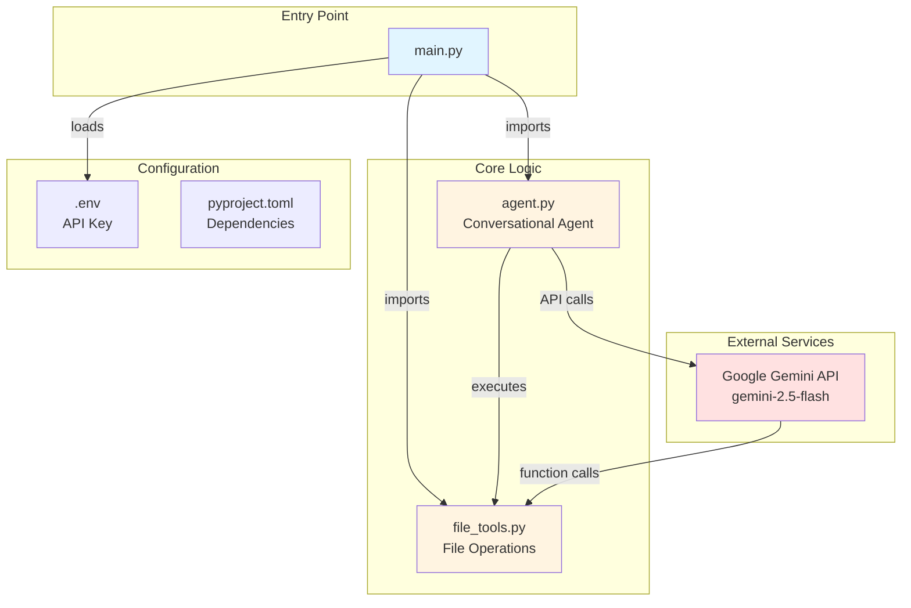
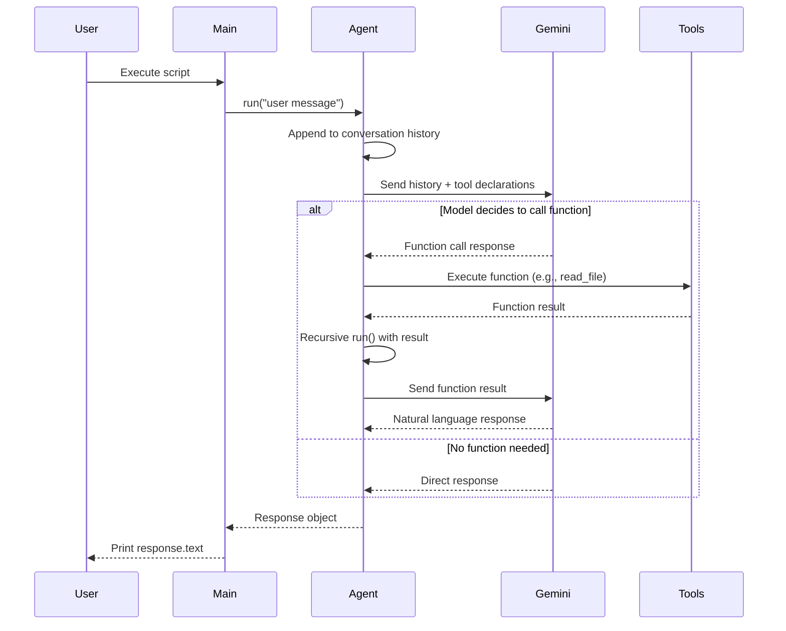

# Codebase Map

> Auto-generated by Cartographer. Last mapped: January 16, 2026

## System Overview

A Python demonstration project showcasing Google's Gemini API through a conversational agent with function calling capabilities. The agent maintains conversation context and can execute file system operations via tools.



## Directory Structure

```
hello-genai/
├── agent.py              # Core conversational agent with Gemini integration
├── main.py               # Entry point with demonstration examples
├── file_tools.py         # File system operation tools (read/write/list)
├── AGENTS.md            # Comprehensive developer/agent guide
├── README.md            # Minimal project description
├── pyproject.toml       # uv package manager configuration
├── .env.example         # Environment variable template
├── .python-version      # Python 3.14 requirement
├── .gitignore           # Git exclusions
└── docs/
    └── CODEBASE_MAP.md  # This file
```

## Module Guide

### agent.py (889 tokens)

**Purpose**: Core conversational agent implementation using Google Gemini with function calling support.

**Key Exports**:
- `Agent` class - Main agent with conversation history and tool execution

**Key Methods**:
- `Agent.__init__(model_id, tools)` - Initialize with model and tool functions
- `Agent.run(user_message)` - Execute conversation turn (supports recursion for function calls)

**Dependencies**:
- `google.genai` - Google's Gemini API client SDK
- `google.genai.types` - Type definitions for API configuration

**Patterns**:
- Stateful conversation management via `self.contents` list
- Recursive tool execution: `run()` calls itself to handle function responses
- Role-based message structure: `{"role": "user", "parts": [...]}`
- Automatic function calling: model decides when to use tools

**Gotchas**:
- Conversation history persists across `run()` calls on the same instance
- Function calls trigger automatic recursive execution
- Tool functions require proper docstrings and type hints for schema generation
- No explicit error handling for function call failures

---

### main.py (401 tokens)

**Purpose**: Entry point demonstrating the agent with file management tools through 4 example interactions.

**Execution Flow**:
1. List files in current directory
2. Read and analyze agent.py
3. Create test_output.txt file
4. Read README.md and create summary.txt

**Dependencies**:
- `dotenv.load_dotenv` - Load `.env` file
- `agent.Agent` - Core agent class
- `file_tools.file_tools` - File system tools

**Patterns**:
- Progressive complexity demonstration
- Multi-turn conversations with context
- Single agent instance used across all examples

**Gotchas**:
- Requires `.env` file with `GEMINI_API_KEY`
- Creates files in working directory (gitignored)
- No error handling for missing files or API failures
- Conversation history carries over between examples

---

### file_tools.py (347 tokens)

**Purpose**: Provides file system operation tools (read, write, list) as callable functions for the agent.

**Key Exports**:
- `read_file(file_path: str) -> str` - Read file contents
- `write_file(file_path: str, contents: str) -> bool` - Write file
- `list_dir(directory_path: str) -> list[str]` - List directory contents
- `file_tools` - List containing all three functions
- `log_function_call` - Decorator for logging function invocations

**Dependencies**:
- `os` - File system operations and path expansion
- `functools.wraps` - Decorator preservation

**Patterns**:
- Decorator pattern for observability
- Tool collection pattern (functions exported as list)
- Docstring-as-schema (docstrings become API descriptions)

**Gotchas**:
- `list_dir` uses `os.path.expanduser()` for `~` expansion
- `write_file` returns `True` without validating success
- No error handling for file not found, permissions, etc.
- Logging via print to stdout (not configurable)

---

## Data Flow

### Conversation Flow



### Function Calling Mechanism

1. **Schema Generation**: Tool functions with docstrings + type hints → Gemini function schemas
2. **Model Decision**: Gemini analyzes user message and available tools
3. **Function Call**: Model returns function call instruction (not text response)
4. **Local Execution**: Agent executes Python function with provided arguments
5. **Result Feedback**: Agent recursively calls `run()` with function result
6. **Final Response**: Model synthesizes natural language response using function output

---

## Configuration

### Environment Variables

| Variable | Required | Source | Purpose |
|----------|----------|--------|---------|
| `GEMINI_API_KEY` | Yes | [Google AI Studio](https://aistudio.google.com/api-keys) | Authenticate Gemini API calls |

### Python Environment

- **Python Version**: 3.14+ (specified in `.python-version`)
- **Package Manager**: `uv` (fast Rust-based tool)
- **Model**: Gemini 2.5 Flash (`gemini-2.5-flash`)

### Dependencies

**Core**:
- `google-genai>=1.52.0` - Google's Gemini API SDK
- `python-dotenv>=1.2.1` - Environment variable management

**Development**:
- `black>=25.11.0` - Code formatter
- `ruff>=0.14.7` - Linter
- `pytest>=9.0.2` - Testing framework (no tests exist yet)

---

## Conventions

### Code Style
- Python 3.14+ syntax
- Black formatting (line length not specified)
- Ruff linting rules (default configuration)
- Type hints required for tool functions

### Function Tools Pattern
- Docstrings serve as function descriptions for Gemini
- Type hints define parameter and return types
- Functions exported as list for easy registration
- Decorator pattern for cross-cutting concerns (logging)

### Message Structure
```python
{
    "role": "user",  # or "model"
    "parts": [
        {"text": "message content"}
    ]
}
```

### Naming Conventions
- Snake_case for functions and variables
- PascalCase for classes
- Descriptive names (e.g., `read_file`, not `read`)

---

## Gotchas & Warnings

### Critical
1. **Conversation State**: Each `Agent` instance maintains history - create new instances for independent conversations
2. **API Key Security**: `.env` file must exist but is gitignored - easy to forget during setup
3. **Bleeding Edge Python**: Requires Python 3.14 (very recent release as of 2024)

### Function Calling
4. **Recursive Execution**: Function calls trigger automatic recursive `run()` - can't intercept mid-flow
5. **No Validation**: File operations don't validate paths, permissions, or write success
6. **Error Propagation**: Function errors bubble up without graceful handling

### Development
7. **No Tests**: Despite pytest installed, no test suite exists
8. **Print-based Logging**: Function calls logged to stdout - no structured logging
9. **Hardcoded Model**: Fixed to Gemini 2.5 Flash - no model switching logic
10. **Output Files**: Examples create files in working directory (`test_output.txt`, `summary.txt`)

### uv Package Manager
11. **Not pip-compatible**: Uses `uv` commands, not `pip install`
12. **Modern Python Only**: uv requires recent Python versions

---

## Navigation Guide

### To run the application:
```bash
# Setup (first time)
uv sync                           # Install dependencies
cp .env.example .env             # Create environment file
# Edit .env and add GEMINI_API_KEY

# Run
uv run main.py                   # Execute demonstration
```

### To add a new tool function:
1. Add function to `file_tools.py` with:
   - Descriptive docstring (becomes API description)
   - Type hints for all parameters and return
   - Optional `@log_function_call` decorator
2. Add function to `file_tools` list export
3. Import in `main.py` and pass to `Agent(tools=[...])`

### To add a new conversation example:
1. Open `main.py`
2. Add new `agent.run("your prompt")` call
3. Print `response.text` or process as needed

### To modify the agent behavior:
- **Change model**: Edit `model_id` in `Agent.__init__` call (main.py:14)
- **Add conversation memory**: Extend `Agent.contents` handling
- **Customize function calling**: Modify `Agent.run()` recursive logic

### To debug function calls:
- Function calls are logged with `[Function Call]` prefix (via `@log_function_call`)
- Inspect `agent.contents` for full conversation history
- Add print statements in `agent.py:run()` method

### To format/lint code:
```bash
uv run black .                   # Format all Python files
uv run ruff check .             # Lint all Python files
```

---

## AI/LLM Capabilities

**Model**: Google Gemini 2.5 Flash
**API**: Google GenAI SDK (`google-genai` package)

**Implemented Features**:
1. **Conversational Context**: Multi-turn conversations with persistent history
2. **Function Calling**: Native Gemini function calling (not manual prompting)
3. **Tool Execution**: Automatic execution of Python functions based on model decisions
4. **File System Operations**: Read, write, and list files via tools
5. **Recursive Tool Chaining**: Model can use multiple tools in sequence

**Not Implemented**:
- Streaming responses
- Multi-modal inputs (images, audio)
- Custom system prompts
- Temperature/sampling control
- Token usage tracking
- Rate limiting
- Conversation export/import
- Tool call approval workflow

---

## Quick Reference

| Task | Command |
|------|---------|
| Install dependencies | `uv sync` |
| Run main script | `uv run main.py` |
| Add new package | `uv add <package>` |
| Format code | `uv run black .` |
| Lint code | `uv run ruff check .` |
| Run tests | `uv run pytest` (no tests exist) |

| File | Purpose |
|------|---------|
| `agent.py` | Gemini agent with function calling |
| `main.py` | Entry point and examples |
| `file_tools.py` | File system tools |
| `AGENTS.md` | Developer guide |
| `.env` | API key (create from `.env.example`) |
